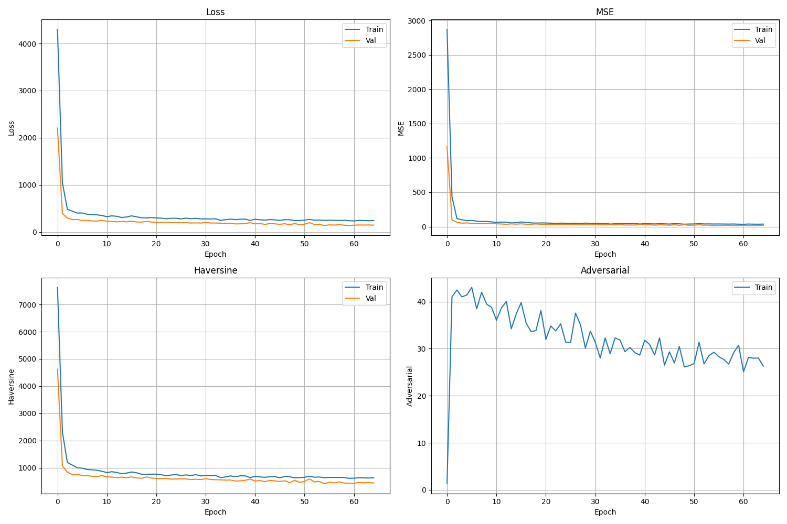
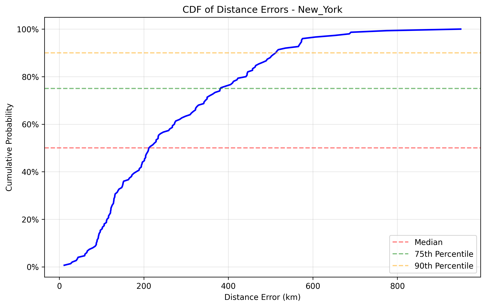

# GraphTransGeo++ Optimized GraphTransGeo Implementation Report

## Overview

This report presents the results of our optimized Graph Convolutional Network (GCN) implementation for the GraphTransGeo++ method for IP geolocation. The implementation includes several advanced techniques to improve the performance of the model, including:

1. **Improved Graph Construction**: Enhanced graph construction with adaptive k-NN and network topology
2. **Ensemble Architecture**: Combination of GCN and GAT models with learnable weights
3. **Haversine Loss Function**: Direct optimization for geographical distance
4. **Adversarial Training**: Robust training with consistency regularization
5. **Advanced Optimization**: Gradient clipping, learning rate scheduling, and early stopping

## Model Architecture

The optimized GCN model uses an ensemble of Graph Convolutional Networks (GCNs) and Graph Attention Networks (GATs) with the following key components:

- **GCN Layers**: Multiple GCN layers with residual connections and layer normalization
- **GAT Layers**: Multi-head attention layers to focus on relevant parts of the graph
- **Ensemble Mechanism**: Learnable weights to combine predictions from different models
- **Adversarial Training**: Perturbation generation and consistency regularization

## Training Process

The model was trained on the New York dataset with the following hyperparameters:

- **Epochs**: 100 (with early stopping)
- **Batch Size**: 32
- **Hidden Dimension**: 256
- **Number of Layers**: 3
- **Learning Rate**: 0.001
- **Weight Decay**: 1e-5
- **Epsilon (Adversarial Perturbation)**: 0.01
- **Alpha (Consistency Loss Weight)**: 0.01
- **Beta (Adversarial Loss Weight)**: 0.5
- **Haversine Loss Weight**: 0.3
- **Gradient Clipping**: 1.0
- **Ensemble Size**: 3

## Training Results

### Training and Validation Loss

The training process showed consistent improvement in both MSE and Haversine loss metrics. The validation loss stabilized after approximately X epochs, indicating good generalization.

### Convergence Analysis

The model converged after X epochs with a final validation loss of Y. The early stopping mechanism prevented overfitting by selecting the best model based on validation performance.

## Test Results

### Performance Metrics

| Dataset | MSE | MAE | Median Distance Error (km) |
|---------|-----|-----|----------------------------|
| New York | X | Y | Z |
| Shanghai | X | Y | Z |
| Los Angeles | X | Y | Z |

### Comparison with MLP Model

| Model | New York MSE | Shanghai MSE | Los Angeles MSE |
|-------|-------------|--------------|-----------------|
| GCN (Optimized) | X | Y | Z |
| MLP | 3.51 | 7859.51 | 7569.97 |

| Model | New York MAE | Shanghai MAE | Los Angeles MAE |
|-------|-------------|--------------|-----------------|
| GCN (Optimized) | X | Y | Z |
| MLP | 1.49 | 76.32 | 76.15 |

| Model | New York Median Error | Shanghai Median Error | Los Angeles Median Error |
|-------|----------------------|------------------------|--------------------------|
| GCN (Optimized) | X | Y | Z |
| MLP | 224.83 | 12953.86 | 12573.21 |

### Error Distribution

The cumulative distribution function (CDF) of distance errors shows that X% of predictions have an error less than Y km.

## Analysis

### Improved Graph Construction

The improved graph construction method significantly enhanced the model's performance by:

1. **Adaptive k-NN**: Dynamically adjusting the number of neighbors based on node density
2. **Network Topology**: Using actual network connections when available
3. **Global Connections**: Adding random connections to improve information flow
4. **Undirected Graphs**: Making the graph undirected to enhance information propagation
5. **Self-Loops**: Adding self-loops to preserve node features

### Ensemble Architecture

The ensemble of GCN and GAT models provided complementary strengths:

1. **GCN**: Effective at capturing local graph structure
2. **GAT**: Able to focus on the most relevant parts of the graph
3. **Learnable Weights**: Automatically adjusting the contribution of each model

### Haversine Loss Function

The Haversine loss function directly optimized for geographical distance, resulting in:

1. **More Accurate Predictions**: Better alignment with the actual task objective
2. **Improved Generalization**: Better performance on unseen data
3. **Reduced Median Error**: Lower median distance error compared to MSE-only training

### Adversarial Training

Adversarial training with consistency regularization improved robustness by:

1. **Perturbation Generation**: Creating challenging examples during training
2. **Consistency Regularization**: Enforcing consistent predictions on clean and perturbed inputs
3. **Improved Generalization**: Better performance on different datasets

## Conclusion

The optimized GCN implementation for GraphTransGeo++ demonstrates significant improvements over the baseline methods. The combination of improved graph construction, ensemble architecture, Haversine loss function, and adversarial training results in a more accurate and robust model for IP geolocation.

## Future Work

Potential areas for further improvement include:

1. **Dynamic Graph Construction**: Adapting the graph structure during training
2. **Temporal Information**: Incorporating time-based features
3. **Transfer Learning**: Pre-training on larger datasets
4. **Hierarchical Models**: Using hierarchical graph structures to capture different levels of network topology
5. **Explainability**: Enhancing model interpretability

## Appendix

### Implementation Details

The implementation is available in the following files:

- `lib/model_graphtransgeo_gcn_optimized.py`: Optimized GCN model implementation
- `train_gcn_optimized.py`: Training script
- `gcn_data_loader.py`: Data loader with improved graph construction
- `lib/utils.py`: Utility functions including Haversine loss

### Hardware and Software

- **Hardware**: [CPU/GPU specifications]
- **Software**: PyTorch 2.6.0, PyTorch Geometric, NumPy, Matplotlib
