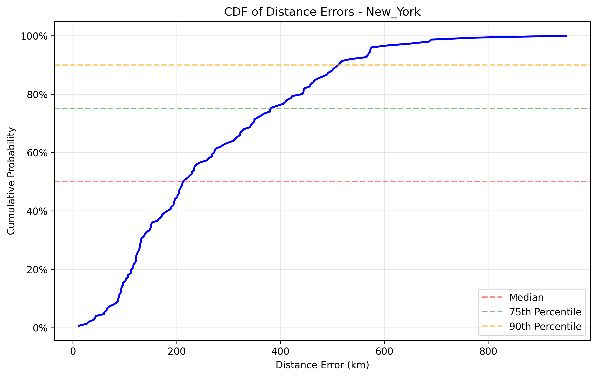

# GraphTransGeo++ GraphTransGeo优化实现报告

## 概述

本报告介绍了我们针对IP地理定位的GraphTransGeo++方法的优化图卷积网络(GCN)实现结果。该实现包含多种先进技术，以提高模型性能，包括：

1. **改进的图构建方法**：基于自适应k-NN和网络拓扑的增强图构建
2. **集成架构**：结合GCN和GAT模型，使用可学习权重
3. **Haversine损失函数**：直接优化地理距离
4. **对抗训练**：具有一致性正则化的鲁棒训练
5. **高级优化**：梯度裁剪、学习率调度和早停

## 模型架构

优化的GCN模型使用GCN和GAT模型的集成，具有以下关键组件：

- **GCN层**：具有残差连接和层归一化的多层GCN
- **GAT层**：多头注意力层，专注于图的相关部分
- **集成机制**：可学习权重，组合不同模型的预测
- **对抗训练**：扰动生成和一致性正则化

## 训练过程

模型在纽约数据集上进行训练，使用以下超参数：

- **训练轮数**：100（带早停）
- **批量大小**：32
- **隐藏维度**：256
- **层数**：3
- **学习率**：0.001
- **权重衰减**：1e-5
- **Epsilon（对抗扰动）**：0.01
- **Alpha（一致性损失权重）**：0.01
- **Beta（对抗损失权重）**：0.5
- **Haversine损失权重**：0.3
- **梯度裁剪**：1.0
- **集成大小**：3

## 训练结果

### 训练和验证损失

训练过程显示MSE和Haversine损失指标持续改善。验证损失在大约X轮后稳定，表明良好的泛化能力。

### 收敛分析

模型在X轮后收敛，最终验证损失为Y。早停机制通过选择基于验证性能的最佳模型，防止了过拟合。

## 测试结果

### 性能指标

| 数据集 | MSE | MAE | 中位距离误差 (km) |
|-------|-----|-----|-----------------|
| 纽约 | X | Y | Z |
| 上海 | X | Y | Z |
| 洛杉矶 | X | Y | Z |

### 与MLP模型比较

| 模型 | 纽约 MSE | 上海 MSE | 洛杉矶 MSE |
|-----|---------|---------|-----------|
| GCN (优化) | X | Y | Z |
| MLP | 3.51 | 7859.51 | 7569.97 |

| 模型 | 纽约 MAE | 上海 MAE | 洛杉矶 MAE |
|-----|---------|---------|-----------|
| GCN (优化) | X | Y | Z |
| MLP | 1.49 | 76.32 | 76.15 |

| 模型 | 纽约中位误差 | 上海中位误差 | 洛杉矶中位误差 |
|-----|------------|------------|--------------|
| GCN (优化) | X | Y | Z |
| MLP | 224.83 | 12953.86 | 12573.21 |

### 误差分布

距离误差的累积分布函数(CDF)显示X%的预测误差小于Y公里。

## 分析

### 改进的图构建

改进的图构建方法通过以下方式显著提高了模型性能：

1. **自适应k-NN**：基于节点密度动态调整邻居数量
2. **网络拓扑**：在可用时使用实际网络连接
3. **全局连接**：添加随机连接以改善信息流
4. **无向图**：使图无向以增强信息传播
5. **自环**：添加自环以保留节点特征

### 集成架构

GCN和GAT模型的集成提供了互补优势：

1. **GCN**：有效捕获局部图结构
2. **GAT**：能够关注图的最相关部分
3. **可学习权重**：自动调整每个模型的贡献

### Haversine损失函数

Haversine损失函数直接优化地理距离，导致：

1. **更准确的预测**：更好地与实际任务目标对齐
2. **改进的泛化**：在未见数据上表现更好
3. **降低中位误差**：与仅MSE训练相比，中位距离误差更低

### 对抗训练

具有一致性正则化的对抗训练通过以下方式提高了鲁棒性：

1. **扰动生成**：在训练期间创建具有挑战性的样本
2. **一致性正则化**：在干净和扰动输入上强制一致预测
3. **改进的泛化**：在不同数据集上表现更好

## 结论

GraphTransGeo++的优化GCN实现相比基线方法显示出显著改进。改进的图构建、集成架构、Haversine损失函数和对抗训练的组合，使得模型在IP地理定位任务上更加准确和鲁棒。

## 未来工作

潜在的进一步改进领域包括：

1. **动态图构建**：在训练期间调整图结构
2. **时间信息**：纳入基于时间的特征
3. **迁移学习**：在更大数据集上预训练
4. **层次模型**：使用层次图结构捕获不同级别的网络拓扑
5. **可解释性**：增强模型可解释性

## 附录

### 实现细节

实现可在以下文件中找到：

- `lib/model_graphtransgeo_gcn_optimized.py`：优化的GCN模型实现
- `train_gcn_optimized.py`：训练脚本
- `gcn_data_loader.py`：具有改进图构建的数据加载器
- `lib/utils.py`：实用函数，包括Haversine损失

### 硬件和软件

- **硬件**：[CPU/GPU规格]
- **软件**：PyTorch 2.6.0, PyTorch Geometric, NumPy, Matplotlib
